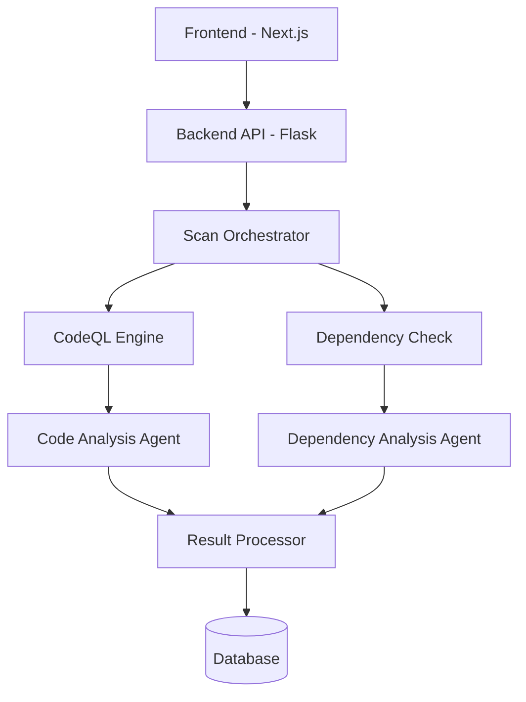

# Architecture Overview

## System Components

### 1. Frontend Layer (Next.js)
- Dashboard UI for scan management
- Real-time scan status updates
- Result visualization
- Written in TypeScript with Tailwind CSS

### 2. Backend Layer (Flask)
- REST API endpoints
- Scan orchestration
- Result processing
- Database integration

### 3. Analysis Engines
- CodeQL for SAST
- OWASP Dependency Check for SCA
- LLM Agents for enhanced analysis

### 4. Database Layer
- PostgreSQL for production
- SQLite for development
- SQLAlchemy ORM

## System Architecture Diagram

## Data Flow

1. User initiates scan via frontend
2. Backend validates and creates scan record
3. Scan Orchestrator manages parallel execution
4. Analysis engines process repository
5. LLM agents enhance findings
6. Results stored in database
7. Frontend polls for updates